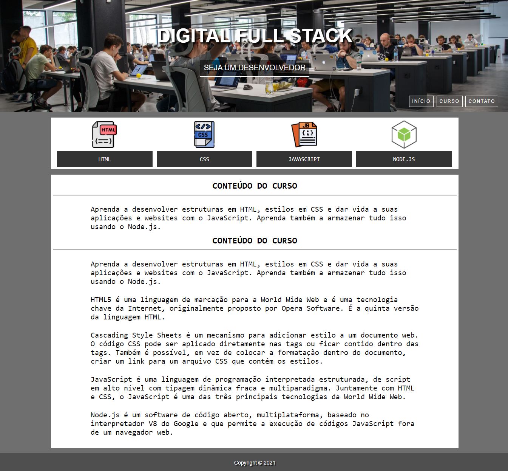

# Digital Full Stack

## Sobre o projeto.
Site estático desenvolvido no Visual Studio Code utilizando HTML e CSS. Apenas a primeira página de um site para a venda de cursos de uma escola de tecnologia, dei o nome de Digital Full Stack. Desenvolvimento em Full Stack na parte de Front end com as tecnologias de HTML, CSS. O principal slogan da escola é:<br><br> Seja um desenvolvedor completo, aprenda HTML, CSS, JavaScript e Node.js. Estude conosco e melhore o seu futuro. A melhor escola de tecnologia do Brasil.<br><br>
Data de conclusão: 09/10/2021<br>
## Ferramentas e tecnologias usadas nesse projeto.
```js    
function DigitalFullStack(Project) {
    const FrontEnd = `${HTML}, ${CSS}`;
};

``` 
<br>

<div align="center">



</div>

<br><br>

---

> - Autores: 
>   - [Eduardo Kayke](https://github.com/EduardoKayke "Perfil do Eduardo")

- [Voltar ao perfil do Github.](https://github.com/EduardoKayke "Perfil do Eduardo")

_Um dia seremos a tecnologia. Biohacking a própria evolução de nós mesmos._